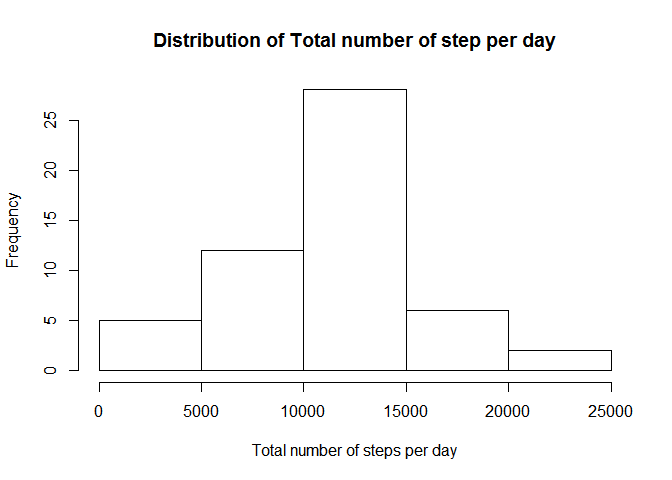
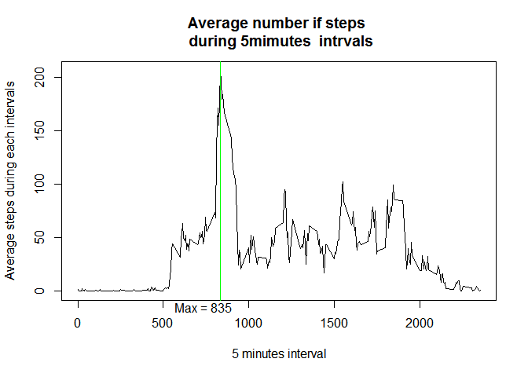
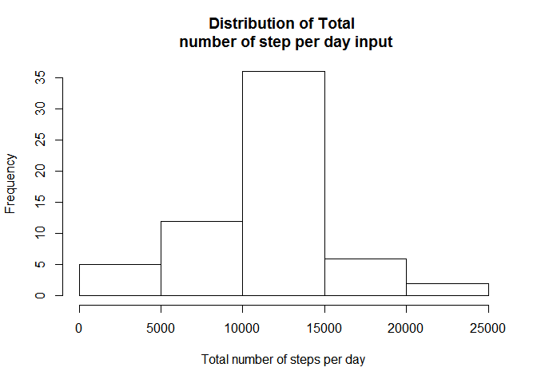
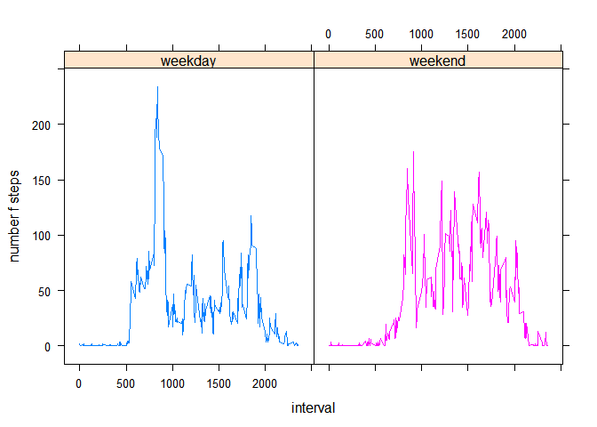
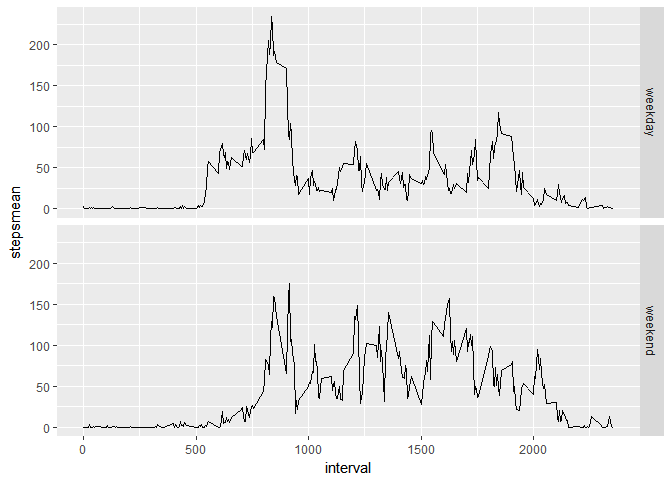

# Activity monitory
Emmanuel Mbecho Techago  
23 September 2017  


## Project Description

This assignment makes use of data from a personal activity monitoring device. This device collects data at 5 minute intervals through out the day. The data consists of two months of data from an anonymous individual collected during the months of October and November, 2012 and include the number of steps taken in 5 minute intervals each day.


```r
### loading the data
Activity <-
  read.csv("activity.csv")
```

### Descriptive Statistics

This section explore descriptive statistics like means 


```r
###loading dplyr package
library(dplyr)
```

```
## Warning: package 'dplyr' was built under R version 3.3.3
```

```
## 
## Attaching package: 'dplyr'
```

```
## The following objects are masked from 'package:stats':
## 
##     filter, lag
```

```
## The following objects are masked from 'package:base':
## 
##     intersect, setdiff, setequal, union
```

```r
##mean total of steps taken per day

###mean steps per day
mean_steps_perday <-
  Activity %>%
  group_by(date) %>%
  summarise(mean = mean(steps, na.rm = T)) 

##output
mean_steps_perday
```

```
## # A tibble: 61 × 2
##          date     mean
##        <fctr>    <dbl>
## 1  2012-10-01      NaN
## 2  2012-10-02  0.43750
## 3  2012-10-03 39.41667
## 4  2012-10-04 42.06944
## 5  2012-10-05 46.15972
## 6  2012-10-06 53.54167
## 7  2012-10-07 38.24653
## 8  2012-10-08      NaN
## 9  2012-10-09 44.48264
## 10 2012-10-10 34.37500
## # ... with 51 more rows
```

```r
###mean total steps per day

mean_total <-
  round(sum(mean_steps_perday$mean, na.rm = T),2)

###output
mean_total
```

```
## [1] 1981.28
```


```r
###total number of steps taken per day
totalnstep <- 
  Activity %>%
  group_by(date) %>%
  summarise(totalns = sum(steps))

###
totalnstep
```

```
## # A tibble: 61 × 2
##          date totalns
##        <fctr>   <int>
## 1  2012-10-01      NA
## 2  2012-10-02     126
## 3  2012-10-03   11352
## 4  2012-10-04   12116
## 5  2012-10-05   13294
## 6  2012-10-06   15420
## 7  2012-10-07   11015
## 8  2012-10-08      NA
## 9  2012-10-09   12811
## 10 2012-10-10    9900
## # ... with 51 more rows
```


```r
###histogram of total number of steps taken each days
hist(totalnstep$totalns,
     xlab = "Total number of steps per day",
     main = "Distribution of Total number of step per day")
```

<!-- -->


```r
##mean and median of the total number of steps taken per day
meantsteps <- 
  round(mean(totalnstep$totalns, 
       na.rm = T ),2)
  
meantsteps
```

```
## [1] 10766.19
```

```r
mediantsteps <- 
  round(median(totalnstep$totalns, 
       na.rm = T ),2)

mediantsteps
```

```
## [1] 10765
```


```r
###average daily activity pattern

###odering the intervals in ascending order

arrange(Activity, interval)
```


```r
###grouping according to intervals
###and looking for the means of the steps across 
###the intervals

across_mean <- 
  Activity %>%
  group_by(interval) %>%
  summarise(
    stepsmean = mean(steps, na.rm = T)
    )

###plotting the graphs

{
plot(across_mean$interval, 
     across_mean$stepsmean,
     type = "l",
     main = "Average number if steps \n during 5mimutes  intrvals",
     xlab = "5 minutes interval",
     ylab = "Average steps during each intervals")

###looking for the observation number which 
###contains the max value, there after

 ###extracting the row which have the max value 
 ###and there by obtaining the 5 minute steps interval 
 ##which is associated with the maximum number of steps
 
 max_5 <- across_mean[which.max(across_mean$stepsmean),]

 ##drewing the vertical line to show the 5 minutes interval
 ## having the max steps and labellling the maximum steps. 
abline(
  v = max_5$interval,
       col = "green",
       mtext("Max = 835", 
             side = 1, 
             adj = 0.3)
       )
}
```

<!-- -->


## Imputaing missing Value


```r
nmissingval <- 
  is.na(Activity$steps)

table(nmissingval)
```

```
## nmissingval
## FALSE  TRUE 
## 15264  2304
```

```r
###there are 2304 missing values in steps

###imputing the missing values in the using Hmisc package

library(Hmisc)
```

```
## Warning: package 'Hmisc' was built under R version 3.3.3
```

```
## Loading required package: lattice
```

```
## Warning: package 'lattice' was built under R version 3.3.3
```

```
## Loading required package: survival
```

```
## Warning: package 'survival' was built under R version 3.3.3
```

```
## Loading required package: Formula
```

```
## Warning: package 'Formula' was built under R version 3.3.2
```

```
## Loading required package: ggplot2
```

```
## Warning: package 'ggplot2' was built under R version 3.3.3
```

```
## 
## Attaching package: 'Hmisc'
```

```
## The following objects are masked from 'package:dplyr':
## 
##     combine, src, summarize
```

```
## The following objects are masked from 'package:base':
## 
##     format.pval, round.POSIXt, trunc.POSIXt, units
```

```r
###here, I will assign the mean value  of the
###steps to the missing value

Activity$imputed_steps <-
  with(Activity, 
       impute(steps, mean))
```


##Histogram of total number of steps


```r
###total number of steps taken per day
totalnstepinput <- 
  Activity %>%
  group_by(date) %>%
  summarise(totalnsinput = sum(imputed_steps))
```


```r
###histogram of total number of steps taken each days 
hist(totalnstepinput$totalnsinput,
     xlab = "Total number of steps per day",
     main = "Distribution of Total \n number of step per day input")
```

<!-- -->


##Mean and median after impputation


```r
##mean and median of the total number of steps taken per day
meantstepsinput <- 
  round(mean(totalnstepinput$totalnsinput, 
       na.rm = T ),2)
  
meantstepsinput
```

```
## [1] 10766.19
```

```r
mediantstepsinput <- 
  round(median(totalnstepinput$totalnsinput, 
       na.rm = T ),2)

mediantstepsinput
```

```
## [1] 10766.19
```

```r
###When comparing the mean and median befoe and after inputation, the mean remain unchange but the
##has converge to the mean. The new data set now have mean and median being equal. Hence the data points are now more equally spread arround the center.
```


## Weekday and Weekend


```r
Activity <-  mutate(Activity,
    dayfactor = factor(weekdays(as.Date(date))
                       
                       ))
levels(Activity$dayfactor)[levels(Activity$dayfactor)==c("Friday","Monday",
                                                         "Saturday","Sunday",
                                                         "Thursday","Tuesday",
                                                         "Wednesday")] <- c("weekday","weekday",
                                                                            "weekend","weekend",
                                                                            "weekday","weekday",
                                                                            "weekday")
```


####Panel Plot


```r
###average daily activity pattern

###odering the intervals in ascending order

arrange(Activity, dayfactor)
```


```r
###grouping according to intervals and the days of the weeks
###and looking for the means of the steps across 
###the intervals

Panel_across_mean <- 
  Activity %>%
  group_by(dayfactor, interval) %>%
  summarise(
    stepsmean = mean(steps, na.rm = T)
    )

library(lattice)

xyplot(data = Panel_across_mean,
       stepsmean ~
        interval|dayfactor,
       groups = dayfactor,
      type = "l",
      xlab = "interval",
      ylab = "number f steps"
      )
```

<!-- -->

```r
ggplot(data = Panel_across_mean,
       aes(interval, stepsmean)) + geom_line(aes(group = dayfactor)) +
  facet_grid(dayfactor ~.)
```

<!-- -->

##Conclusion
There is clear difference in pattern between the weekdays and weekend. However, between intervels from 500 to 100, both weekdays and weeks have thier highest average steps during this period. While there is huge fluction in the weekday at the interval 500 - 1000, the weekends steps are almost equally spread aaround the intervsls, except at the begining steps.
